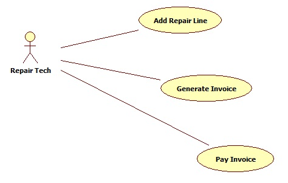
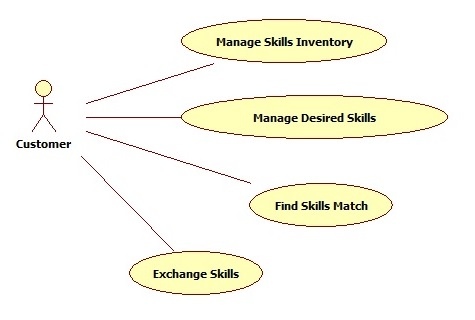
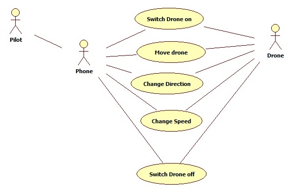

# Team_00
* Team member 1
* Team member 2
* and so on
## I. Business/Concept Description
Here you will give a brief overview of your proposed system and the business or concept it supports.
Examples: 
* Example 1: New Application in Existing Business: “We would like to develop an application that will allow GG Garage Door Repair to generate invoices for customers at the site of a repair. The application would also accept credit or debit card payment”.
* Example 2: New Business: “We would like to start a business that allows people to exchange skills such as furniture assembly, painting, etc. The application we develop would enable people to post the skills they had to offer and the skills they would accept in exchange.”
* Example 3: Concept: "We are developing a prototype that will allow a cell phone to communicate with a drone."
## II. (Business)Processes Being Automated
List the processes being automated. The types of processes will depend on the type of system you are creating. Please give a short description of each. The examples below are just lists of processes, you are required to add a short description to each. 
### From Example 1 above the processes might be:
1. Generate Invoice
1. Accept Payment
### From Example 2 above:
1. Post skills and desired exchange
1. Make the exchange
### From Example 3 above:
1. Drive drone movement via phone.

## III. System Use Cases Identified – Diagrams
Include one or more use case diagrams that show the system use cases that are necessary to implement your system. Potential system use case diagrams are shown for the examples listed previously.
### Use Case Diagram for Garage Repair Invoicing 

### Use Case Diagram for Skills Exchange

### Use Case Diagram for Drone via Phone

## IV. Casual Use Case Descriptions
Describe each use case at the casual level (see Larman text, section 6.2 and 6.7) under its name. Names should match the use case diagram. Examples of casual use case descriptions follow (these are not complete, just samples): 
### Add Repair Line
#### Main Success Scenario:
* Repair person enters each repair description and price
* As each line is entered the system calculates running total with taxes
#### Alternate Scenario:
* Repair Person needs to correct an entry: navigates back to the entry and makes required changes. System recalculates total and taxes.
* Repair Person needs to delete an entry: navigates back to entry and deletes. System recalculates total and taxes.
### Find Skills Match
#### Main Success Scenario
* Customer requests a match
* System searches skills database comparing customer skills requested with skills available by other customers. If a match is found the system then checks if the customer found is looking for skills that the current customer possesses.
* This continues until all matches are found. The system then presents all matches for review.
#### Alternate Flows:
* No match found: the system ends the process.

### Change Speed 
#### Main Success Scenario:
* The pilot presses the phone key that has been designated as change speed.
* The phone asks the drone to change speed and the drone complies 
#### Alternate Flows:
* Speed requested exceeds maximum speed as per settings: drone slows to minimum speed and an alert is generated on the phone.
* Speed requested is lower than minimum speed as per settings: Drone remains at the minimum speed and an alert is generated on the phone.

## V. Technologies
Briefly explain the technologies (languages, DBMS, development platforms, specific hardware, etc.) that you plan to use for your project and justify your choices.
