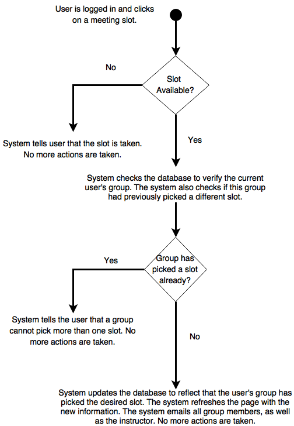
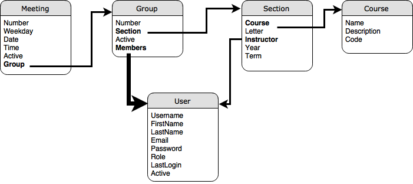
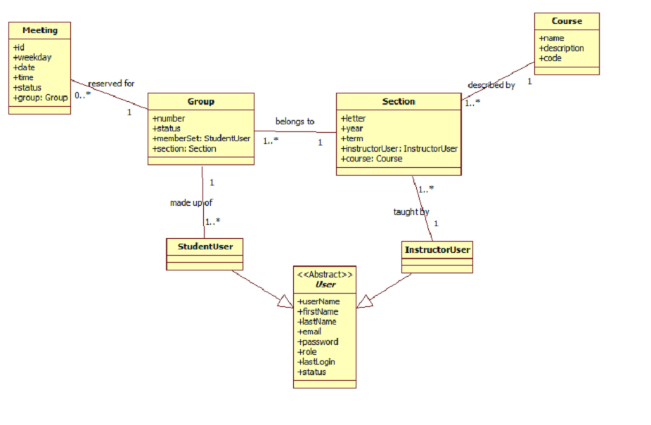

# Activity Diagrams

## Booking a Meeting
Below, you can see an activity diagram showing all steps taken by the user, as well as by the system, in order to book a meeting.

#  

# Database Design

In this document, we will present how all classes for our system, which are described in the domain_classes.md document, translate into a database design. Note that this web application does not follow closely an Object Oriented design paradigm. Therefore, our classes contain only properties (but not methods). These properties are explained below as they relate to the database design. At the bottom, we will show an image showcasing how different database tables are interconnected. I am also presenting at the very end how this database could be visualized using a formal domain model representation.

## User
* Username - Unique name that identifies the user in the system (String)
* Firstname - User's first name (String)
* Lastname - User's last name (String)
* Email - User's email address (EmailField)
* Password - User's password (String)
* Role - User's role in the system. Valid entries are: FAculty and Student (String)
* LastLogin - Last time the user has logged into the system (DateField)
* Active - Boolean variable that checks if the user is considered an active user or not (Boolean)

## Group
* Number - Group's number (Integer)
* Section - Section that all group members are attending. For example, BTS530A (ForeignKey->Section)
* Members - Group members (ManyToManyForeignKey->User)
* Active - Boolean variable that checks if the group is considered an active group or not (Boolean)

## Meeting
* Number - Meeting's number (Integer)
* Weekday - Day of the week in which the meeting is taking place (Integer [0,6])
* Date - Date of the year in which the meeting is take place (DateField)
* Time - Time of the day in which the meeting is taking place (String)
* Active - Boolean variable that checks if the meeting is considered an active, i.e., has been picked, by a group or not (Boolean)
* Group - Group that has booked the meeting (ForeignKey->Group)

## Course
* Name - Name of the course. For example: Major Project - Planning and Design (String)
* Description - Quick description of the course (String)
* Code - Course's code. For example, BTS530 (String)

## Section
* Course - ForeignKey(Course)
* Letter - Letter representing the section. For example, A or B in BTS530A or BTS530B (String)
* Instructor - User assigned as a instructor for this section (ForeignKey->User)
* Year - Year in which the sectio is taking place (String)
* Terms - Term in which the section is taking place (String: winter, summer, or fall)

## Interconnection between different tables

The figure below show how different tables are interconnected. Note that the connection between users and groups is a many to many relationship.

## Domain Model

